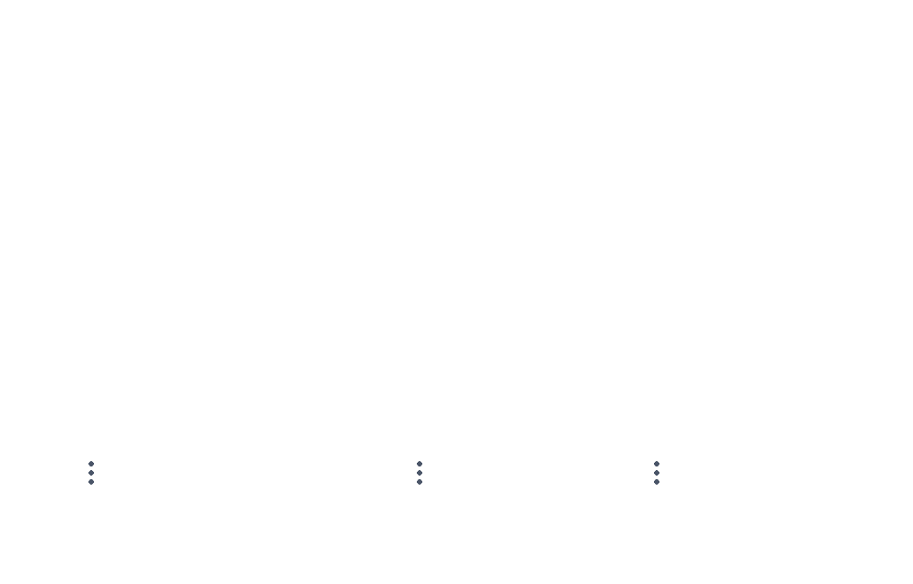

# Introduction

## Features & Components

This homework creates a multithreaded client-server file transfer
system. The homework has the following components:

-   A server that remains open despite the client disconnecting. The
    server will continue to accept connections and transfer requested
    files.

-   The server will be able to clients simultaneously, but this process
    is not multithreaded.

-   A client that connects to the server, requests a file, and then
    remains connected until the user disconnects.

-   The filetransfer protocol is multithreaded and uses multiple sockets
    to send the file which achieves data security.

-   The filetransfer makes sure the empty characters are not being
    written and the new file created is the same size as the original
    file.

-   The codebase contains 4 files:

    -   `server.c`

    -   `server.h`

    -   `client.c`

    -   `client.h`

    -   `helpers.h`

    -   `makefile`

## Usage

To compile the code, run the following command in the terminal:

         make

To run the server, type:

        ./server <ip> <port>

To run the client, type:

        ./client <ip> <port>

For example, to run the server and client on the same local machine
(`127.0.0.1`), on port `8080`, and to request a file named `test.txt`
and save it as `testNew.txt`, type:

       ./server 127.0.0.1 8080 (Terminal 1)
       ./client 127.0.0.1 8080 (Terminal 2)

The client will request the user to input:

1.  Requested file name

2.  Number of threads to transfer in

3.  Save file as name

The user can disconnect using the `EXIT` command.

::: center

:::

## Functions

In the `server.c` file, there are the following functions:

``` {.c firstline="2" lastline="21" language="c"}
/*
 * Sends file to client in a single thread
 * @param socket - socket to send file to
 * @return 1 if file send, 0 if file not sent
 */
int sendFile(int socket);
/*
 * Reads and Sends a certain chunk of a file
 * @param *threadarg - struct containing fp, socket, buffer, s, f, fSize
 * @return void*
 */
void *threadedFileRead(void *threadarg);
/*
 * Sends file to client via multiple threads
 * @param socket - socket to send file to
 * @return 1 if file send, 0 if file not sent
 */
int threadedSendFile(int socket, char *fileName, int NUM_THREADS, char *ip,
                     int port);
```

In the `client.c` file, there are the following functions, and have the
following functionalities.

``` {.c firstline="2" lastline="22" language="c"}
/*
 * Recieves file from server in a single thread
 * @param socket - socket to recieve file from
 * @param filename - name of file to recieve
 * @return 1 if file recieved, 0 if file not recieved
 */
int recieveFile(int socket, char *filename);
/*
 * Writes a certain chunk to a file
 * @param *threadarg - struct containing fp, socket, buffer, s, f, fSize
 * @return void*
 */
void *threadedFileWrite(void *threadarg);
/*
 * Recieves file from server via multiple threads
 * @param socket - socket to recieve file from
 * @param filename - name of file to recieve
 * @return 1 if file recieved, 0 if file not recieved
 */
int threadedRecieveFile(int socket, char *filename, int NUM_THREADS, char *ip,
                        int port);
```

In the `helpers.h` file, there is the struct that is used to pass
information to the threads.

``` {.c firstline="11" lastline="20" language="c"}
// #define SIZE 1024

struct thread_data {
  FILE *fp;
  long s, f, fSize;
  int id, port;
  char *ip;
  char *fileName;
};
```

## Design

The design of the server is as follows:

1.  The server will accept connections from n clients.

2.  The client will request a file from the server in `m` threads

3.  The server will open `m` ports and send the file to the client in
    `m` threads.

4.  The client will recieve the file from the server `m` ports and write
    the data to `m .part` files.

5.  The client will then concatenate the `.part` files into a new file
    with the name given by the user.

The below figure shows the server's design.


